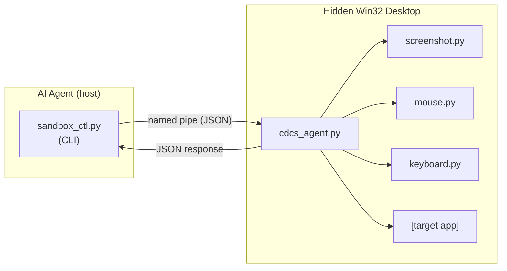

# DCS - Desktop Control System

**Isolated GUI automation for AI agents on Windows.**

DCS lets AI agents launch, screenshot, click, type, and interact with desktop applications on **hidden Win32 desktops** — completely isolated from the user's visible screen.

> **This is not a screen-takeover tool.** DCS does not move your mouse, steal keyboard focus, or block your workflow. Everything happens on an invisible desktop you never see. You keep working normally while the agent does its thing.


## Why This Exists

AI agents are great at editing files and running CLI commands, but they can't interact with GUI applications. Legacy tools, simulators, form-heavy apps — anything without an API or CLI is a dead end.

DCS solves this by creating **invisible Win32 desktops** where applications run in full isolation. An agent process on the hidden desktop receives commands over a named pipe and executes them using Win32 APIs. The user's mouse and keyboard are never touched.

## Architecture



- **Host process** creates a Win32 desktop, spawns the agent, sends one command per pipe connection
- **Agent process** runs on the hidden desktop, dispatches commands to input/capture modules
- **Screenshots** use `PrintWindow` (works on hidden desktops where BitBlt returns black)
- **Mouse clicks** use a 3-tier fallback: UIA > PostMessage > SendInput
- **Keyboard** uses `PostMessage WM_CHAR` / `WM_KEYDOWN` (reliable on hidden desktops)

## Quick Start

```bash
# Create an isolated desktop session
python sandbox_ctl.py create my-session

# Launch an application on it
python sandbox_ctl.py launch my-session "C:\Program Files\App\app.exe"

# Take a screenshot (renders even on hidden desktop)
python sandbox_ctl.py screenshot my-session --output screen.png

# Click, type, send keys
python sandbox_ctl.py click my-session 400 300
python sandbox_ctl.py type my-session "Hello world"
python sandbox_ctl.py key my-session ctrl+s

# Clean up
python sandbox_ctl.py destroy my-session
```

## Commands

| Command | Description |
|---------|-------------|
| `create <session>` | Create hidden desktop + agent process |
| `destroy <session>` | Tear down session and kill processes |
| `launch <session> <exe>` | Launch app on hidden desktop |
| `screenshot <session>` | Capture window as PNG |
| `click <session> <x> <y>` | Click at coordinates (client-area relative) |
| `type <session> <text>` | Type text via PostMessage WM_CHAR |
| `key <session> <combo>` | Send key combo (e.g. `ctrl+s`, `alt+f4`) |
| `scroll <session> <x> <y> <delta>` | Scroll at position |
| `windows <session>` | List all windows on desktop |
| `focus <session> <hwnd>` | Focus a specific window |
| `list` | List all active sessions |

All commands accept `--hwnd <handle>` to target a specific window.

## Installation

### Option 1: Download binary (recommended)

Grab the latest release from [Releases](https://github.com/aShanki/desktop-control-system/releases):

```bash
# Unzip and add to PATH
dcs create test-session
dcs launch test-session notepad.exe
dcs screenshot test-session --output test.png
dcs destroy test-session
```

### Option 2: From source

Requires Windows 10/11 and Python 3.12+.

```bash
git clone https://github.com/aShanki/desktop-control-system.git
cd desktop-control-system
pip install -r requirements.txt
python sandbox_ctl.py create test-session
```

### Verify Installation

If `test.png` shows a Notepad window, everything is working.

### Claude Code Integration

Copy `skill/SKILL.md` into your Claude Code skill directory, or add this project's `skill/` folder to your Claude Code configuration. The skill file teaches the agent how to use the DCS agent loop.

## Configuration

| Environment Variable | Description | Default |
|---------------------|-------------|---------|
| `CDCS_PYTHON_EXE` | Path to Python interpreter used to spawn agent processes | `sys.executable` (the Python running `sandbox_ctl.py`) |

## Supported Applications

Works with standard Win32 toolkits: Win32, WPF, WinForms, Electron, Qt, GTK.

## Limitations

- DirectX/OpenGL full-screen apps return black screenshots (windowed mode works)
- UWP apps may have limited PostMessage support
- Qt6 apps need `WM_MOUSEMOVE` before clicks (DCS handles this automatically)
- DPI scaling may affect coordinate accuracy
